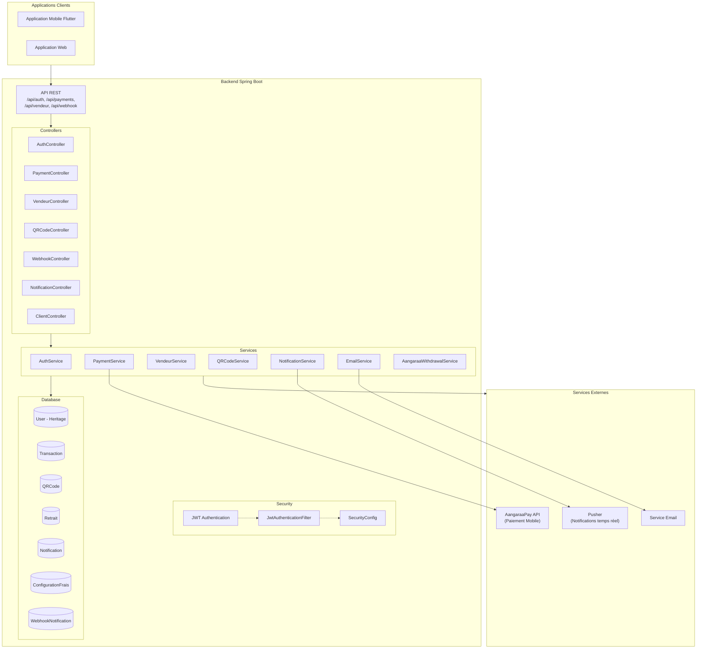
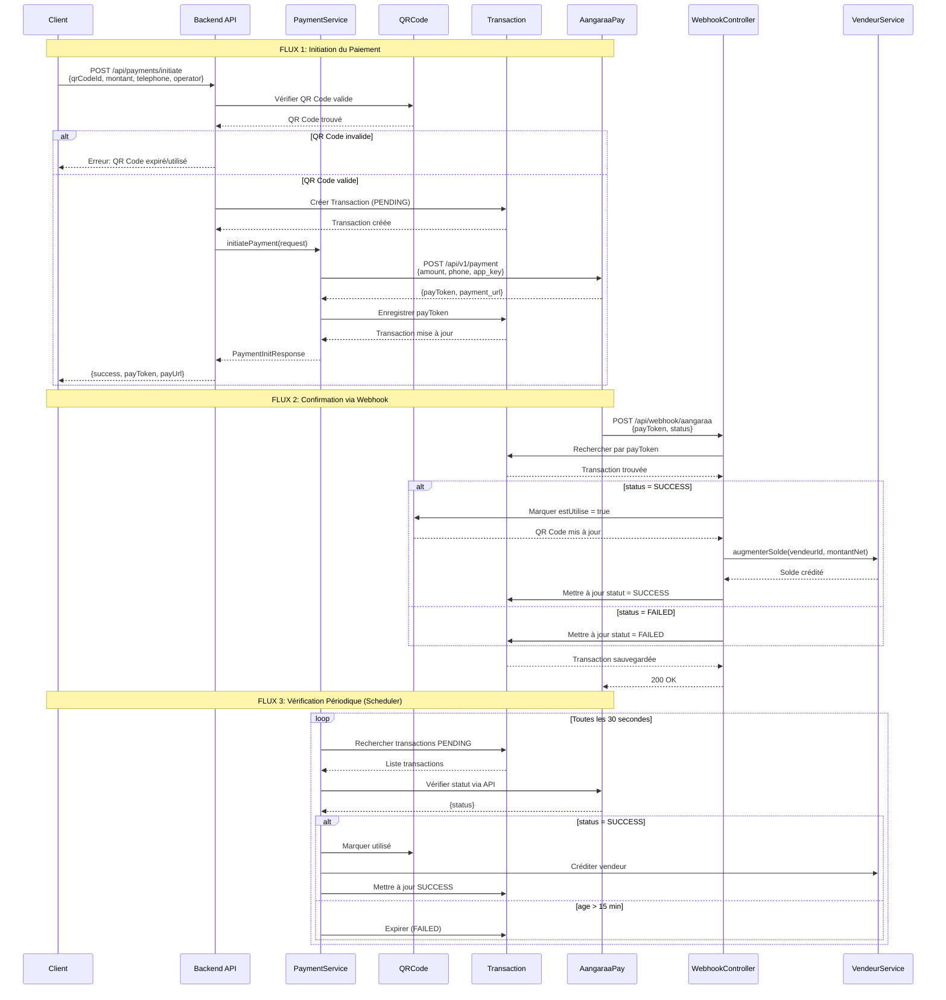
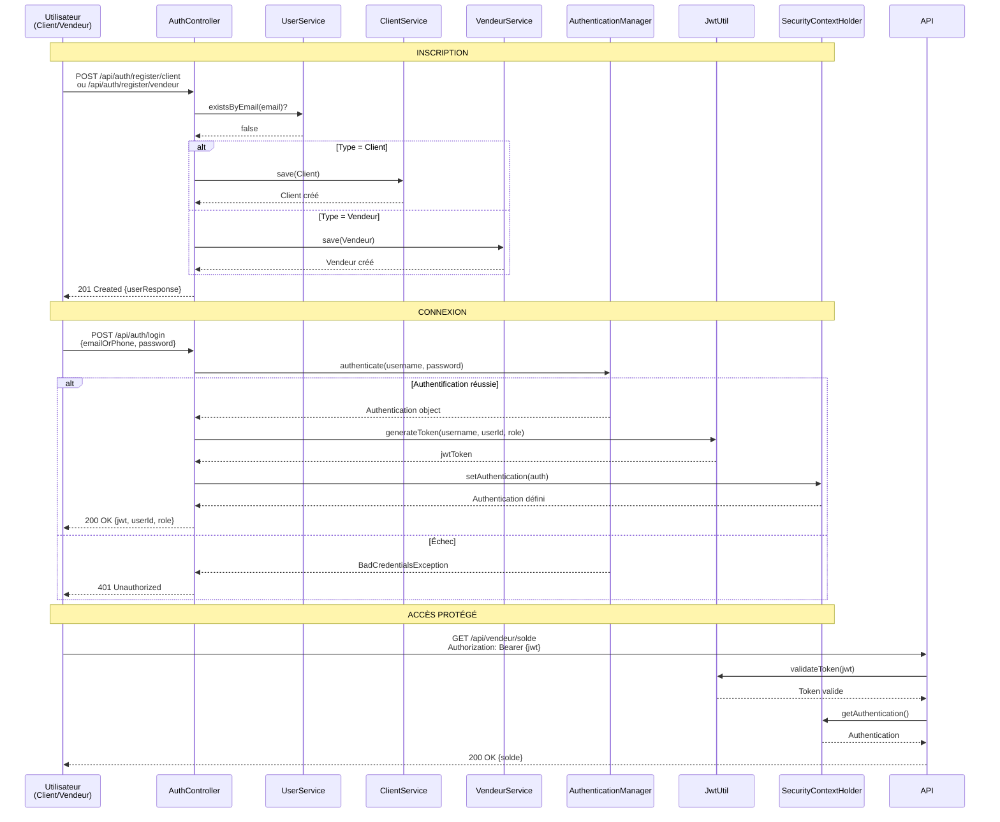
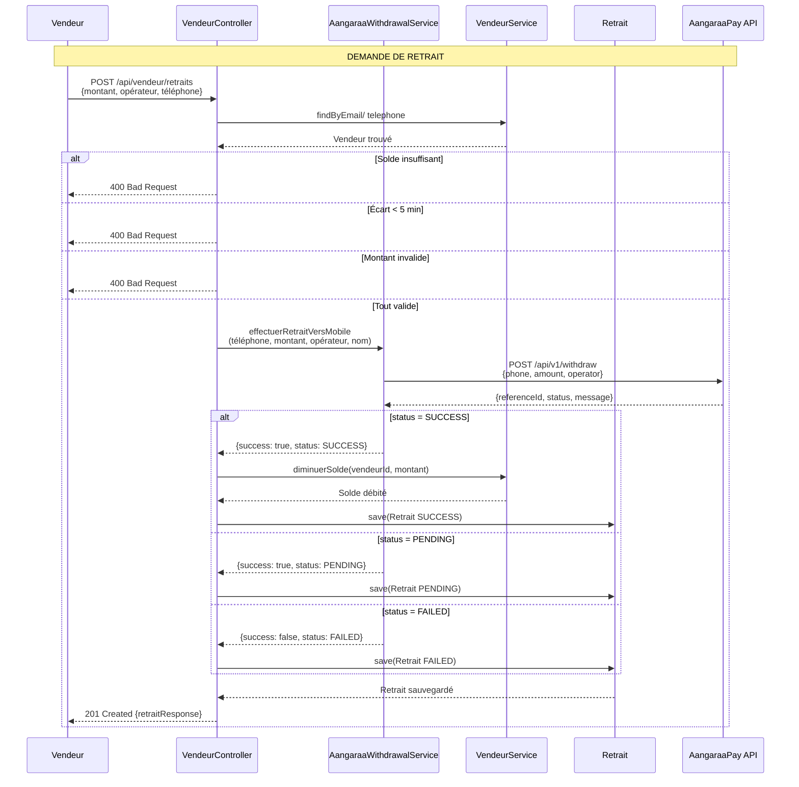
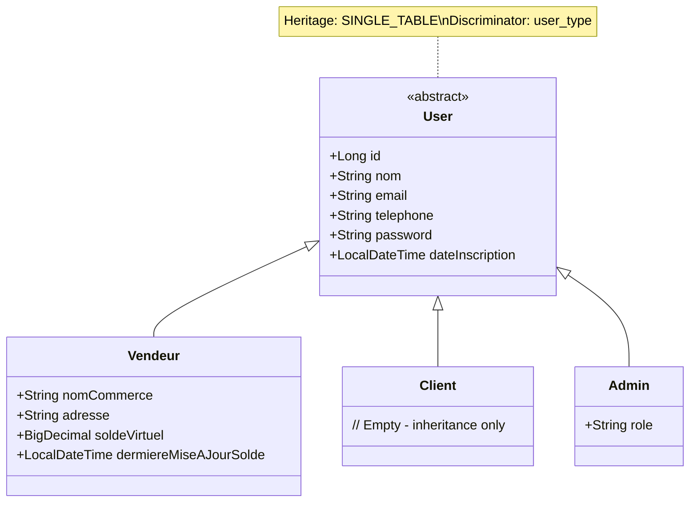

# Diagrammes UML - Backend Fapshi QR Payment

Ce document contient tous les diagrammes UML générés à partir du code source du backend Spring Boot.

---

## 1. Diagramme d'Architecture du Système



---

## 2. Diagramme de Classes (Entities)

```mermaid
classDiagram
    <<abstract>> User
    User <|-- Vendeur
    User <|-- Client
    User <|-- Admin
    
    class User {
        +Long id
        +String nom
        +String email
        +String telephone
        +String password
        +LocalDateTime dateInscription
    }
    
    class Vendeur {
        +String nomCommerce
        +String adresse
        +BigDecimal soldeVirtuel
        +LocalDateTime derniereMiseAJourSolde
    }
    
    class Client {
        // Heritage only
    }
    
    class Admin {
        +String role
    }
    
    QRCode "1" -- "many" Transaction : generates
    Vendeur "1" -- "many" QRCode : owns
    Vendeur "1" -- "many" Retrait : requests
    Vendeur "1" -- "many" Notification : receives
    Transaction "1" -- "1" QRCode : paid via
    
    class QRCode {
        +Long id
        +String qrPayload
        +String contenu
        +String description
        +BigDecimal montant
        +LocalDateTime dateCreation
        +LocalDateTime dateExpiration
        +boolean estUtilise
        +String hash
        +Vendeur vendeur
    }
    
    class Transaction {
        +Long id
        +String transactionId
        +Client client
        +QRCode qrCode
        +String telephoneClient
        +BigDecimal montant
        +String statut
        +String payToken
        +String payUrl
        +String referenceOperateur
        +String operator
        +LocalDateTime dateCreation
        +LocalDateTime dateExpiration
        +BigDecimal commissionAppliquee
        +BigDecimal montantNet
    }
    
    class Retrait {
        +Long id
        +Vendeur vendeur
        +BigDecimal montant
        +String statut
        +LocalDateTime dateCreation
        +LocalDateTime dateAttempt
        +String referenceId
        +String operateur
        +String message
        +String telephone
    }
    
    class Notification {
        +Long id
        +Vendeur vendeur
        +String type
        +String titre
        +String message
        +LocalDateTime dateCreation
        +boolean lue
        +String pusherEventId
    }
    
    class ConfigurationFrais {
        +Long id
        +BigDecimal tauxPlateforme
        +BigDecimal fraisRetraitFixe
        +BigDecimal montantMinimum
        +BigDecimal montantMaximum
        +BigDecimal commissionRate
    }
```

---

## 3. Diagramme des Cas d'Utilisation

```mermaid
flowchart TB
    subgraph Acteurs
        Client["Client<br/>(Acheteur)"]
        Vendeur["Vendeur<br/>(Marchand)"]
        Admin["Administrateur"]
        System["Système<br/>(AangaraaPay)"]
    end
    
    subgraph UseCases["Cas d'Utilisation"]
        subgraph AuthUC["Authentification"]
            Register["S'inscrire"]
            Login["Se connecter"]
            ResetPwd["Réinitialiser mot de passe"]
        end
        
        subgraph PaymentUC["Paiement"]
            GenQR["Générer QR Code"]
            ScanQR["Scanner QR Code"]
            InitPay["Initier paiement"]
            ConfirmPay["Confirmer paiement"]
            CheckStatus["Vérifier statut"]
        end
        
        subgraph VendorUC["Gestion Vendeur"]
            ViewSolde["Voir solde virtuel"]
            RecalcSolde["Recalculer solde"]
            ViewTrans["Voir transactions"]
            ExportCSV["Exporter CSV"]
            Withdraw["Demander retrait"]
            ViewWithdraw["Voir retraits"]
        end
        
        subgraph NotifUC["Notifications"]
            SendNotif["Envoyer notification"]
            ReceiveNotif["Recevoir notification"]
            MarkRead["Marquer comme lu"]
        end
        
        subgraph WebhookUC["Webhooks"]
            ReceiveWebhook["Recevoir webhook"]
            ProcessPayment["Traiter paiement"]
            ProcessWithdrawal["Traiter retrait"]
        end
    end
    
    Client --> Login
    Client --> Register
    Client --> ScanQR
    Client --> InitPay
    Client --> CheckStatus
    
    Vendeur --> Login
    Vendeur --> Register
    Vendeur --> GenQR
    Vendeur --> ViewSolde
    Vendeur --> RecalcSolde
    Vendeur --> ViewTrans
    Vendeur --> ExportCSV
    Vendeur --> Withdraw
    Vendeur --> ViewWithdraw
    Vendeur --> ReceiveNotif
    
    System --> ReceiveWebhook
    System --> ProcessPayment
    System --> ProcessWithdrawal
```



---

## 4. Diagramme de Séquence - Flux de Paiement



---

## 5. Diagramme de Séquence - Authentification JWT



---

## 6. Diagramme de Séquence - Retrait (Withdrawal)



---

## 7. Diagramme ER (Entité-Relation)

```mermaid
erDiagram
    USERS {
        bigint id PK
        varchar nom
        varchar email
        varchar telephone
        varchar password
        datetime date_inscription
        varchar user_type "VENDEUR|CLIENT|ADMIN"
    }
    
    VENDEURS {
        bigint id PK
        varchar nom_commerce
        varchar adresse
        decimal(19,2) solde_virtuel
        datetime derniere_maj_solde
    }
    
    QR_CODES {
        bigint id PK
        text qr_payload
        text contenu
        varchar description
        decimal(19,2) montant
        datetime date_creation
        datetime date_expiration
        boolean est_utilise
        varchar hash
        bigint vendeur_id FK
    }
    
    TRANSACTIONS {
        bigint id PK
        varchar transaction_id
        bigint client_id FK
        bigint qr_code_id FK
        varchar telephone_client
        decimal(19,2) montant
        varchar statut "PENDING|SUCCESS|FAILED|EXPIRED"
        varchar pay_token
        varchar pay_url
        varchar reference_operateur
        varchar operator
        datetime date_creation
        datetime date_expiration
        decimal(19,2) commission_appliquee
        decimal(19,2) montant_net
    }
    
    RETRAITS {
        bigint id PK
        bigint vendeur_id FK
        decimal(19,2) montant
        varchar statut "PENDING|SUCCESS|FAILED"
        datetime date_creation
        datetime date_attempt
        varchar reference_id
        varchar operateur
        varchar message
        varchar telephone
    }
    
    NOTIFICATIONS {
        bigint id PK
        bigint vendeur_id FK
        varchar type
        varchar titre
        text message
        datetime date_creation
        boolean lue
        varchar pusher_event_id
    }
    
    CONFIGURATION_FRAIS {
        bigint id PK
        decimal(19,4) taux_plateforme
        decimal(19,2) frais_retrait_fixe
        decimal(19,2) montant_minimum
        decimal(19,2) montant_maximum
        decimal(19,4) commission_rate
    }
    
    WEBHOOK_NOTIFICATIONS {
        bigint id PK
        varchar pay_token
        varchar status
        text message
        datetime date_reception
        boolean traite
        int tentatives
        varchar transaction_id_externe
    }
    
    USERS ||--o| VENDEURS : "hérite"
    USERS ||--o| CLIENTS : "hérite"
    USERS ||--o| ADMINS : "hérite"
    VENDEURS ||--o{ QR_CODES : "génère"
    VENDEURS ||--o{ RETRAITS : "demande"
    VENDEURS ||--o{ NOTIFICATIONS : "reçoit"
    QR_CODES ||--o{ TRANSACTIONS : "génère"
    TRANSACTIONS }o--|| QR_CODES : "paie"
    TRANSACTIONS }o--|| CLIENTS : "effectue"
```

---

## 8. Diagramme de Flux - Traitement Webhook

```mermaid
flowchart TB
    subgraph Aangaraa["AangaraaPay"]
        API["API Paiement"]
        WH["Webhook Service"]
    end
    
    subgraph Backend["Backend Fapshi"]
        WC["WebhookController"]
        NS["NotificationService"]
        VS["VendeurService"]
        T["Transaction"]
        QR["QRCode"]
        V["Vendeur"]
    end
    
    API -->|"1. Paiement confirmé"| WH
    WH -->|"2. POST /webhook/aangaraa"| WC
    
    WC -->|"3. Find by payToken"| T
    T -->|"4. Transaction trouvée"| WC
    
    WC -->|"5. switch(status)"| WC
    
    alt Status = SUCCESS
        WC -->|"6a. handleSuccess"| WC
        WC -->|"7a. Marquer QR utilisé"| QR
        QR -->|"8a. QR sauvegardé"| WC
        WC -->|"9a. Créditer vendeur"| VS
        VS -->|"10a. Solde mis à jour"| WC
        WC -->|"11a. Notifier (Pusher)"| NS
    else Status = FAILED
        WC -->|"6b. Marquer FAILED"| T
    else Status = PENDING
        WC -->|"6c. Garder PENDING"| T
    end
    
    T -->|"12. Sauvegarder"| T
    WC -->|"13. 200 OK"| WH
```

---

## 9. Diagramme des Composants (Package Structure)

```mermaid
flowchart TB
    subgraph "com.fapshi.backend"
        subgraph config["config"]
            AC[AppConfig]
            OC[OpenApiConfig]
            PC[PusherConfig]
        end
        
        subgraph controller["controller"]
            Auth[AuthController]
            Pay[PaymentController]
            Vend[VendeurController]
            QR[QRCodeController]
            Web[WebhookController]
            Notif[NotificationController]
            Cli[ClientController]
        end
        
        subgraph service["service"]
            AuthS[AuthService]
            PayS[PaymentService]
            VendS[VendeurService]
            QRCodeS[QRCodeService]
            NotifS[NotificationService]
            EmailS[EmailService]
            AWS[AangaraaWithdrawalService]
        end
        
        subgraph entity["entity"]
            User[User]
            Vend[Vendeur]
            Cli[Client]
            Trans[Transaction]
            QR[QRCode]
            Ret[Retrait]
            Notif[Notification]
            Conf[ConfigurationFrais]
        end
        
        subgraph repository["repository"]
            UserR[UserRepository]
            VendR[VendeurRepository]
            TransR[TransactionRepository]
            QRR[QRCodeRepository]
            RetR[RetraitRepository]
            NotifR[NotificationRepository]
        end
        
        subgraph security["security"]
            JWT[JwtUtil]
            JWTF[JwtAuthenticationFilter]
            CustU[CustomUserDetailsService]
            SecC[SecurityConfig]
        end
        
        subgraph dto["dto"]
            Req[Request DTOs]
            Res[Response DTOs]
            Ext[External DTOs]
        end
    end
    
    controller --> service
    controller --> dto
    service --> entity
    service --> repository
    security --> dto
    config --> service
```



---

## 10. Tableau Récapitulatif des Endpoints API

| Méthode | Endpoint | Rôle | Description |
|--------|----------|------|-------------|
| POST | `/api/auth/register/client` | PUBLIC | Inscription client |
| POST | `/api/auth/register/vendeur` | PUBLIC | Inscription vendeur |
| POST | `/api/auth/login` | PUBLIC | Connexion JWT |
| POST | `/api/auth/forgot-password` | PUBLIC | Demande reset mot de passe |
| POST | `/api/auth/reset-password` | PUBLIC | Reset mot de passe |
| POST | `/api/payments/initiate` | PUBLIC* | Initier paiement |
| GET | `/api/payments/success` | PUBLIC | Retour paiement |
| GET | `/api/payments/status/{id}` | AUTH | Vérifier statut |
| POST | `/api/webhook/aangaraa` | PUBLIC | Webhook paiement |
| GET | `/api/qr/generate` | VENDEUR | Générer QR Code |
| GET | `/api/vendeur/solde` | VENDEUR | Voir solde virtuel |
| PUT | `/api/vendeur/recalculer-solde` | VENDEUR | Recalculer solde |
| GET | `/api/vendeur/transactions` | VENDEUR | Liste transactions |
| GET | `/api/vendeur/transactions/export-csv` | VENDEUR | Exporter CSV |
| POST | `/api/vendeur/retraits` | VENDEUR | Demander retrait |
| GET | `/api/vendeur/retraits` | VENDEUR | Liste retraits |
| GET | `/api/vendeur/solde-aangaraa` | VENDEUR | Solde Aangaraa |

---

## 11. Diagramme d'Héritage des Entities



---

## 12. Diagramme de Flux - Authentification et Autorisation

```mermaid
flowchart TB
    subgraph Client["Requête Client"]
        Req["Request + JWT"]
    end
    
    subgraph Filter["JwtAuthenticationFilter"]
        Extract["Extraire Token"]
        Validate["Valider Token"]
        LoadUser["Charger UserDetails"]
        SetAuth["Set SecurityContext"]
    end
    
    subgraph Security["Spring Security"]
        Config["SecurityConfig"]
        Rules["Authorization Rules"]
    end
    
    subgraph Controller["Controller"]
        Endpoint["Endpoint Handler"]
    end
    
    Req --> Extract
    Extract --> Validate
    
    alt Token Invalide
        Validate -->|401 Unauthorized| Client
    else Token Valide
        Validate --> LoadUser
        LoadUser --> SetAuth
        SetAuth --> Rules
        Rules -->|Autorisé| Endpoint
        Rules -->|Interdit| 403["403 Forbidden"]
    end
```

---

*Document généré automatiquement à partir du code source du backend Spring Boot Fapshi QR Payment*
